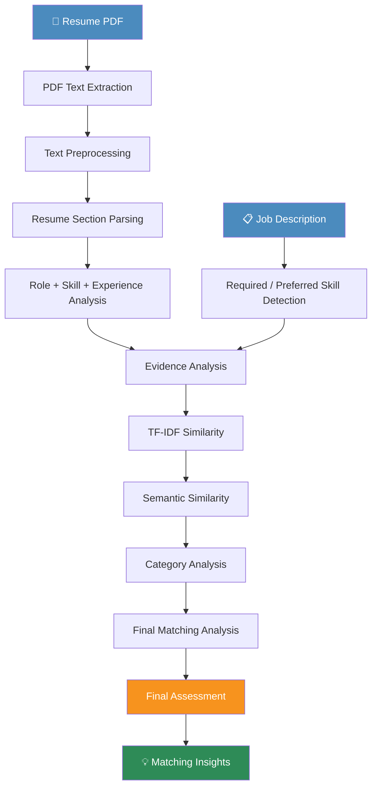

<div align="center">

# 🧠 ResumeIQ

### AI-Powered Resume–Job Matching System

*Beyond keyword matching — structured, evidence-backed candidate–job alignment insights.*


</div>

---

## 📑 Table of Contents

- [Overview](#-overview)
- [Why ResumeIQ](#-why-resumeiq)
- [Features](#-features)
- [Architecture](#-architecture)
- [Matching Pipeline](#-matching-pipeline)
- [Project Structure](#-project-structure)
- [Technology Stack](#-technology-stack)
- [How It Works](#-how-it-works)
  - [Skill Matching](#skill-matching)
  - [Priority Detection](#priority-detection)
  - [Experience Analysis](#experience-analysis)
  - [Evidence Analysis](#evidence-analysis)
  - [TF-IDF Similarity](#tf-idf-similarity)
  - [Semantic Similarity](#semantic-similarity)
  - [Final Assessment](#final-assessment)
  - [Matching Insights](#matching-insights)
- [Installation](#-installation)
- [Running the App](#-running-the-app)
- [Testing](#-testing)
- [Example Job Description](#-example-job-description)
- [Example Output](#-example-output)
- [Privacy & Security](#-privacy--security)
- [Roadmap](#-roadmap)
- [Contributing](#-contributing)
- [License](#-license)
- [Author](#-author)
- [Demo](#-demo)

---

## 🔍 Overview

**ResumeIQ** is an intelligent resume–job matching system designed to analyze the alignment between a candidate's resume and a job description with far more depth than simple keyword overlap. It combines **NLP-based parsing**, **skill and experience analysis**, **evidence extraction**, **TF-IDF lexical similarity**, and **semantic similarity** to generate a structured, explainable match report.

Rather than returning a single opaque score, ResumeIQ breaks the match down into role alignment, skill coverage, experience requirements, and supporting evidence — giving both candidates and recruiters a transparent view of *why* a resume does or doesn't fit a role.

---

## 💡 Why ResumeIQ

| Traditional Matching | ResumeIQ |
|---|---|
| Simple keyword search | Structured NLP-based parsing |
| Binary match/no-match | Matched, partially met, not met, unknown |
| No context on skill proof | Evidence-backed skill validation |
| Ignores experience nuance | Parses and compares experience durations |
| No priority awareness | Detects required vs. preferred requirements |
| Purely lexical | Combines lexical (TF-IDF) + semantic similarity |

---

## ✨ Features

### 📄 Resume Processing
- **PDF Resume Extraction** — extracts raw text from resumes using `pypdf`
- **Text Preprocessing** — cleans and normalizes extracted text, standardizes whitespace
- **Resume Section Parsing** — parses Education, Skills, Projects, Experience, Achievements, and Certifications

### 🧩 Skill Intelligence
- **Skill Database** — category-organized skill set defined in `skills.json`
- **Skill Extraction** — extracts skills from both resumes and job descriptions
- **Category-wise Skill Matching** — compares skills grouped by category

### 🎯 Role Analysis
- **Job Role Detection** — detects roles from resume/JD text
- **Role Normalization** — normalizes equivalent or related role names
- **Role Matching** — compares resume role against the target job role

### 📋 Job Description Modes
- **Natural Language JD Mode** — analyzes free-form, natural-language job descriptions
- **Structured JD Mode** — supports structured requirement input
- **Required Skills Detection**
- **Preferred Skills Detection**
- **Skill Coverage Calculation** — matched vs. missing skills with coverage %

### 📊 Similarity Engines
- **TF-IDF Similarity** — lexical similarity between resume and JD
- **Semantic Similarity** — powered by Sentence Transformers (`all-MiniLM-L6-v2`) using embeddings and cosine similarity

### 🕵️ Evidence Analysis
- **Skill Evidence** — identifies supporting evidence for detected skills
- **Evidence Strength** — evaluates how strong/available the evidence is
- **Evidence Summary** — condensed summary of all evidence found
- **Project Evidence** — links skills to specific resume projects
- **Actual Project Name Extraction** — extracts real project names from the resume
- **Experience Evidence** — identifies experience-based skill evidence

### ⏱️ Experience Intelligence
- **Experience Requirement Parsing** — extracts phrases like *"2 years of experience with Python"*
- **Experience Duration Comparison** — compares resume experience duration against JD requirements
- **Unknown Duration Handling** — gracefully handles cases where only a year is mentioned
- **Better Project/Experience Relevance** — determines whether experience genuinely supports required skills

### 🚦 Priority Detection
- **Improved Natural Language Priority Detection** — classifies requirements as required, preferred, or unspecified based on natural phrasing (see [Priority Detection](#priority-detection))

### 🧾 Final Analysis
- **Final Matching/Analysis Framework** — centralizes role, skill, evidence, experience, and similarity analysis
- **Final Assessment** — structured statuses: `matched`, `not matched`, `met`, `not met`, `partially met`, `unknown`
- **Matching Insights** — human-readable explanations generated from the full analysis
- **Integrated Final Console Report** — combines all analyses into one final report

---

## 🏗️ Architecture



---

## 🔄 Matching Pipeline

```
Resume PDF
    ↓
PDF Text Extraction
    ↓
Text Preprocessing
    ↓
Resume Section Parsing
    ↓
Role + Skill + Experience Analysis
    ↓
Job Description Analysis
    ↓
Required / Preferred Skill Detection
    ↓
Experience Requirement Analysis
    ↓
Evidence Analysis
    ↓
TF-IDF Similarity
    ↓
Semantic Similarity
    ↓
Category Analysis
    ↓
Final Matching Analysis
    ↓
Final Assessment
    ↓
Matching Insights
```

---

## 📁 Project Structure

```
AI-Powered Resume–Job Matching System/
│
├── app.py                          # Streamlit application entry point
├── resume_parser.py                # PDF resume extraction
├── preprocessing.py                # Text cleaning & normalization
├── section_parser.py               # Resume section parsing
│
├── skills.json                     # Categorized skill database
├── skill_extraction.py             # Skill extraction logic
├── skill_normalization.py          # Skill normalization logic
│
├── role_detection.py               # Job role detection
├── role_normalization.py           # Role name normalization
├── role_matching.py                # Resume ↔ JD role comparison
│
├── priority_detection.py           # Required/preferred/unspecified detection
├── experience_requirements.py      # Experience requirement parsing
├── experience_duration.py          # Experience duration calculation
├── experience_skill_duration.py    # Skill-specific duration handling
│
├── skill_evidence.py               # Skill evidence identification
├── project_evidence.py             # Project-based evidence extraction
├── experience_evidence.py          # Experience-based evidence extraction
├── evidence_strength.py            # Evidence strength scoring
├── evidence_summary.py             # Evidence summarization
│
├── tfidf_similarity.py             # TF-IDF lexical similarity
├── semantic_similarity.py          # Sentence-Transformer semantic similarity
├── category_analysis.py            # Category-wise skill analysis
│
├── final_matching_analysis.py      # Centralized analysis framework
├── final_assessment.py             # Final status generation
├── matching_insights.py            # Human-readable insight generation
│
├── requirements.txt                # Python dependencies
├── README.md                       # Project documentation
├── LICENSE                         # MIT License
│
└── demo.mp4                        # Application demo video
```

---

## 🛠️ Technology Stack

| Category | Technology |
|---|---|
| Language | Python |
| PDF Processing | pypdf |
| Numerical Computing | NumPy |
| Data Handling | Pandas |
| Machine Learning | Scikit-learn |
| Semantic Embeddings | Sentence Transformers |
| Web Interface | Streamlit |
| Text Processing | Regular Expressions |
| Data Storage (Skills) | JSON |

---

## ⚙️ How It Works

### Skill Matching
Skills are extracted from both the resume and job description using a categorized skill database (`skills.json`). Extracted skills are normalized and compared category-wise to compute matched and missing skills, along with an overall coverage percentage.

### Priority Detection
ResumeIQ analyzes natural-language job descriptions to classify each requirement by priority. It recognizes a wide range of phrasing patterns:

| Priority | Recognized Phrasing |
|---|---|
| **Required** | required, mandatory, essential, must have, must possess |
| **Preferred** | preferred, preferably, nice to have, good to have, bonus, desirable, desired, advantage, would be a plus |
| **Contextual** | optional, strong knowledge of, proficiency in, expertise in |

### Experience Analysis
Experience requirements are parsed from phrasing such as *"3+ years experience in SQL"* or *"At least 1 year of experience with Machine Learning"*. When explicit dates are available, ResumeIQ calculates actual experience duration and compares it against the requirement. When only a year is mentioned, duration is marked as unknown rather than guessed.

### Evidence Analysis
Every detected skill is checked against supporting evidence in the resume — from named projects to described experience. ResumeIQ extracts actual project names, evaluates the strength of the evidence found, and produces a concise evidence summary per skill.

### TF-IDF Similarity
A lexical similarity score is computed between the resume and job description using TF-IDF vectorization, capturing direct term-level overlap.

### Semantic Similarity
Using the `all-MiniLM-L6-v2` Sentence Transformer model, ResumeIQ generates embeddings for the resume and JD, then computes cosine similarity to capture meaning-level alignment beyond exact wording.

### Final Assessment
All analyses — role matching, skill priority, evidence, experience duration, TF-IDF, semantic similarity, and category-wise breakdowns — feed into a centralized framework that produces structured statuses:

- ✅ `matched`
- ❌ `not matched`
- ✅ `met`
- ❌ `not met`
- ⚠️ `partially met`
- ❔ `unknown`

### Matching Insights
Finally, ResumeIQ converts the structured assessment into clear, human-readable insights, explaining *why* a candidate is or isn't a strong fit for the role.

---

## 📥 Installation

```bash
# Clone the repository
git clone https://github.com/shaktikumarsuraj/ResumeIQ.git
cd ResumeIQ

# Create a virtual environment
python -m venv venv

# Install dependencies
pip install -r requirements.txt
```

**requirements.txt**
```
pypdf
scikit-learn
sentence-transformers
streamlit
numpy
pandas
```

---

## ▶️ Running the App

```bash
venv\Scripts\activate
streamlit run app.py
```

The application will be available at:

```
http://localhost:8501
```

---

## ✅ Testing

ResumeIQ has been tested across the following areas:

- PDF extraction
- Preprocessing
- Section parsing
- Skill extraction
- Role detection
- Role normalization
- Role matching
- Required skill detection
- Preferred skill detection
- Experience requirement extraction
- Experience duration extraction
- Experience comparison
- TF-IDF similarity
- Semantic similarity
- Evidence extraction
- Final analysis
- Final assessment
- Matching insights
- Edge-case scenarios

---

## 📋 Example Job Description

```
Software Developer with strong knowledge of Python, C++, Data Structures,
Algorithms, SQL, Git and Problem Solving.

The candidate must have strong programming fundamentals and experience
with software development.

Python and C++ are required.

Knowledge of SQL and Git is preferred.

Experience with Machine Learning would be a plus.
```

---

## 📊 Example Output

```
=========================================
        RESUMEIQ — FINAL REPORT
=========================================

Role Match:            matched
Required Skills:       Python ✅ | C++ ✅
Preferred Skills:      SQL ✅ | Git ⚠️ (partial evidence)
Bonus Skills:          Machine Learning ❌ (not found)

Skill Coverage:         83%
TF-IDF Similarity:      0.61
Semantic Similarity:    0.78

Experience Requirement: Not explicitly specified
Evidence Strength:      Strong (2 supporting projects found)

-----------------------------------------
Final Assessment: PARTIALLY MET
-----------------------------------------

Matching Insight:
"The candidate demonstrates strong evidence of Python and C++ 
proficiency through relevant projects, and preferred skills like 
SQL are partially supported. Machine Learning experience was not 
found in the resume, which may be a gap relative to the bonus 
requirement."
=========================================
```

---

## 🔒 Privacy & Security

To keep this repository safe and clean, please **do not commit** the following:

- ❌ Personal resume PDFs
- ❌ Private candidate information
- ❌ API keys
- ❌ `.env` files
- ❌ Passwords
- ❌ Credentials
- ❌ Secret configuration files

Always use `.gitignore` to exclude sensitive files before pushing changes.

---

## 🗺️ Roadmap

> ⚠️ The following are **planned future enhancements** and are **not part of the current system**.

### Phase 1 — Advanced Matching
- Advanced skill normalization
- Better synonym detection
- Improved experience duration extraction
- More robust NLP requirement parsing
- Better handling of complex job descriptions
- Improved context-aware skill matching

### Phase 2 — AI Enhancement
- LLM-assisted resume analysis
- Explainable AI recommendations
- Context-aware skill inference
- Advanced semantic matching
- Intelligent resume feedback
- AI-generated candidate summaries

### Phase 3 — Recruiter Platform
- Multiple resume comparison
- Candidate comparison dashboard
- Resume database
- Job-wise candidate analytics
- Exportable candidate reports
- Recruiter workspace
- Candidate filtering

### Phase 4 — Production
- Authentication
- Cloud deployment
- API layer
- Database integration
- Scalable inference pipeline
- Production monitoring
- Role-based access control

---

## 🤝 Contributing

Contributions are welcome! To contribute:

1. Fork the repository
2. Create a new branch (`git checkout -b feature/your-feature-name`)
3. Make your changes
4. Commit your changes (`git commit -m "Add: your feature"`)
5. Push to your branch (`git push origin feature/your-feature-name`)
6. Open a Pull Request

Please ensure your changes are well-tested and documented before submitting.

---

## 📄 License

This project is licensed under the **MIT License** — see the [LICENSE](./LICENSE) file for details.

---

## 👤 Author

**Shakti Kumar Suraj**
B.Tech — Computer Science & Engineering
Indian Institute of Information Technology, Ranchi

🔗 GitHub: [github.com/shaktikumarsuraj](https://github.com/shaktikumarsuraj)

---

## 🎬 Demo

Watch the full application walkthrough here: [./demo.mp4](./demo.mp4)
